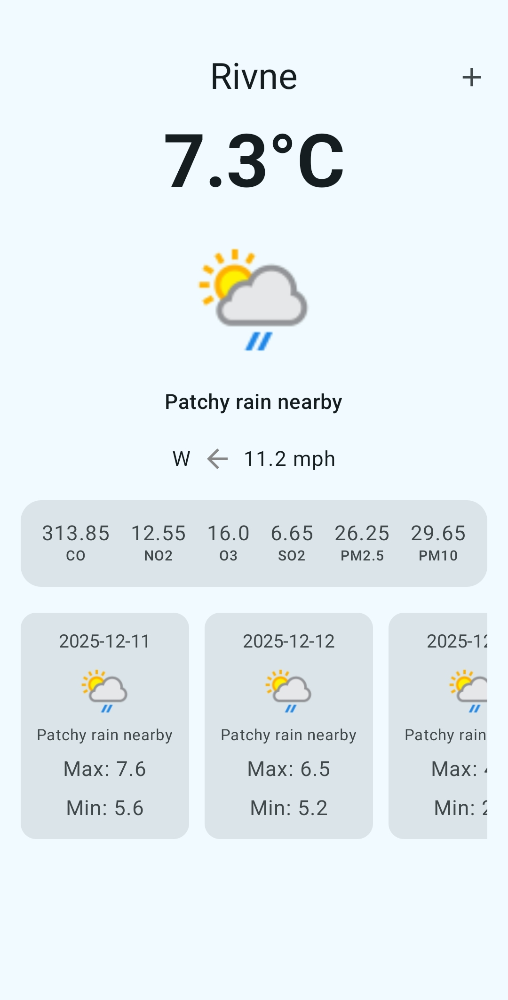
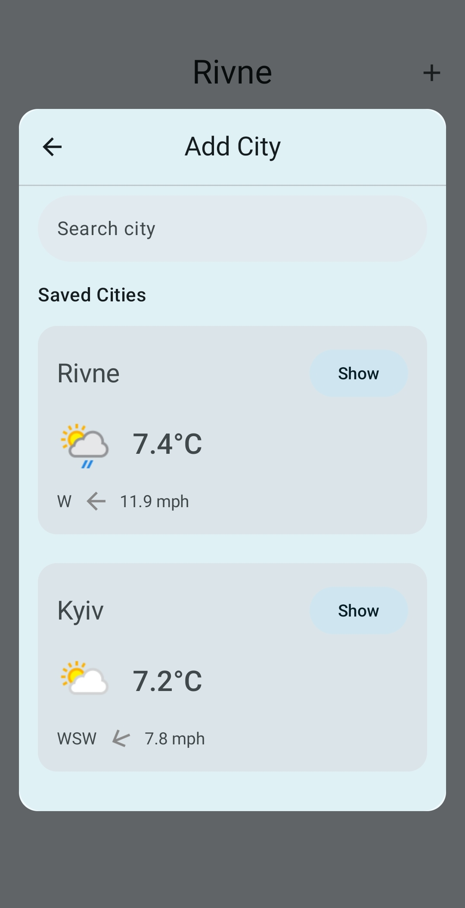
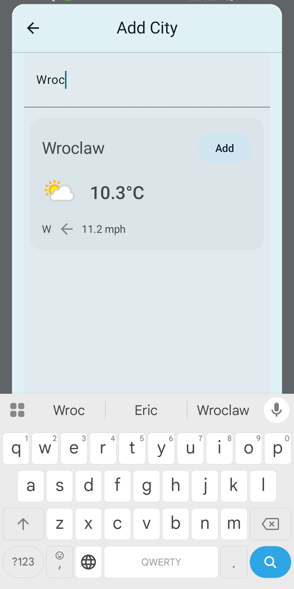

## Weather App

This application utilizes Retrofit, Hilt, Room, and Jetpack Compose. It supports both offline and
online
modes. Users can search for their city and add others to their saved list. Clean Architecture was
used in the project's design, which is reflected in the code structure.

For weather data, I integrate the Weather API from https://www.weatherapi.com/

## Screenshots

